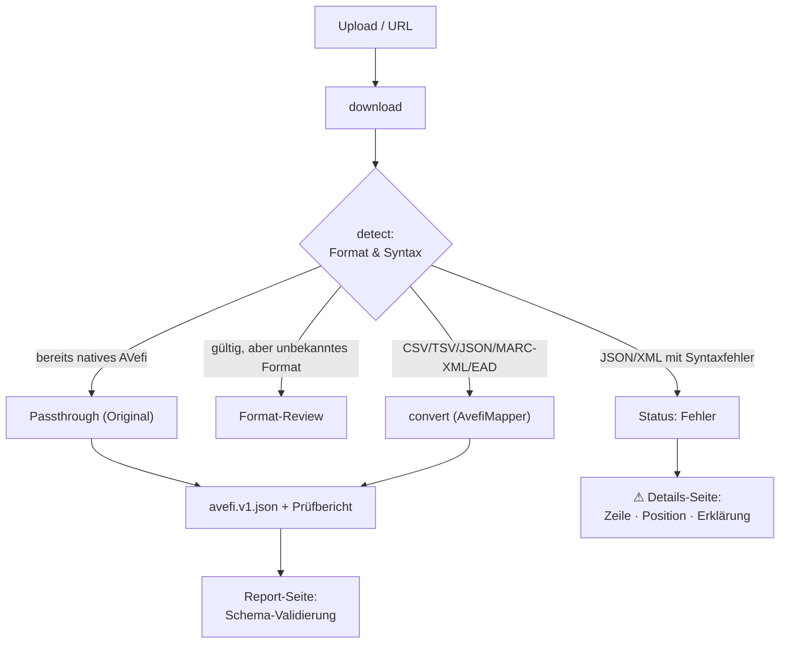

# 2 · Metadaten importieren

## Datei hochladen

Auf der Startseite (Import-Übersicht):

- **Drag & Drop** oder **„Dateien auswählen"** — mehrere Dateien gleichzeitig, max. 200 MB.
- Der Fortschritt wird pro Datei angezeigt; danach erscheint der Import in der Liste.

Unterstützte Formate: **CSV · TSV · JSON · MARC-XML · EAD · (weitere XML → Review)**.

Beispieldateien zum Ausprobieren liegen im Repository unter
[`samples/`](../samples/) (`films.csv`, `films.tsv`, `films.json`, `films.marcxml`,
`films.ead`, `avefi-native.json`).

## Import via URL

Neben dem Datei-Upload gibt es das Feld **„oder per URL"**: eine öffentlich
erreichbare `https://…`-Adresse eintragen und „Von URL laden". Ein Worker lädt die
Datei im Hintergrund herunter und stellt sie wie einen normalen Upload in die Pipeline.

> Interne/private Adressen (localhost, private IP-Bereiche) werden aus
> Sicherheitsgründen abgelehnt.

## Verarbeitung (Worker)

Nach dem Upload liegt der Import auf **„Wartend"**. Die Verarbeitung übernimmt der
**`worker`-Dienst** automatisch: ein Daemon, der jede Minute die `worker_jobs`-Queue
pollt und die Schritte `download` → `detect` → `convert` abarbeitet.

Zum manuellen Anstoßen (Debug):

```bash
docker compose exec web php app/bot.php -t detect    # detect-Jobs einmal abarbeiten
docker compose exec web php app/bot.php -t convert   # convert-Jobs einmal abarbeiten
```

Ablauf je Import:

| Status | Bedeutung |
|--------|-----------|
| Wartend | in der Warteschlange |
| In Konvertierung | Format erkannt, Converter zugeordnet |
| Neues Format – Review nötig | unbekanntes Format → [Format-Review](04-format-review.md) |
| Konvertiert | Datensätze erzeugt, editierbar |
| Fehler | Parsing/Validierung fehlgeschlagen |

Der `worker`-Dienst läuft kontinuierlich (`restart: always`) und startet sich nach
7 Tagen bzw. bei RAM > 1 GB selbst neu.

## Ablauf (Pipeline)



## Format-Erkennung

Das erkannte Format/Schema erscheint als **Badge** in der Import-Übersicht — genauer
als nur „JSON" (z. B. *AVefi (nativ)*, *Objektliste (JSON)*, *MARC-in-JSON*,
*MARC-XML*, *EAD*, *JSON (fehlerhaft)*).

- **CSV/TSV/JSON** mit erkennbarer Titel-Spalte → generischer Converter (deutsche und
  englische Spaltennamen werden heuristisch zugeordnet: Titel, Jahr, Regie, Träger,
  Signatur, Institution, …).
- **Bereits natives AVefi-JSON** wird erkannt und **unverändert durchgereicht**
  (kein erneutes Mapping).
- **MARC-XML** und **EAD** werden am Wurzelelement/Namespace erkannt und mit einem
  spezifischen Converter verarbeitet.
- **Syntaktisch kaputtes JSON/XML** → Status **Fehler** mit
  [Fehlerdetails](03-bearbeiten-und-validieren.md#fehlerdetails-verarbeitungsfehler)
  (Zeile/Position, Code-Ausschnitt, Lösungshinweis).
- Alles andere (gültiges, aber unbekanntes XML/JSON, CSV ohne Titel-Spalte) landet im
  **Format-Review**.

## Excel-Arbeitsmappen

`.xlsx`, `.xls` und `.ods` lassen sich hochladen wie eine CSV. Eine Arbeitsmappe ist
aber keine Tabelle, sondern mehrere — deshalb fragt der Importer, welche Tabellenblätter
verarbeitet werden sollen, sobald mehr als eines Daten enthält.

Die Liste zeigt je Blatt die Zahl der Zeilen und Spalten und eine Einschätzung.
Vorausgewählt sind die Blätter, die nach einer Tabelle aussehen: mindestens zwei Spalten
und eine Datenzeile unter der Kopfzeile. Deckblätter, Legenden und Auswertungen bleiben
außen vor, lassen sich aber ankreuzen, falls die Einschätzung danebenliegt.

**Jedes gewählte Blatt wird ein eigener Import** mit eigener Kopfzeile, eigener Zuordnung
und eigenem Prüfbericht. Das ist Absicht: Zwei Blätter mit verschiedenen Spalten brauchen
verschiedene Zuordnungen. Enthält eine Mappe nur ein brauchbares Blatt, entfällt die
Frage und es geht direkt weiter.

Aus dem gewählten Blatt wird intern eine Tabelle herausgelöst; ab da unterscheidet sich
nichts mehr von einer hochgeladenen CSV. Die Originaldatei bleibt erhalten und lässt sich
über das „…"-Menü weiterhin herunterladen.

Zahlen- und Datumsformate werden so gelesen, wie sie in Excel angezeigt werden. Ein
Drehdatum kommt also als `12.03.1961` an und nicht als `22351` — Excel speichert Daten
intern als Zahl.
