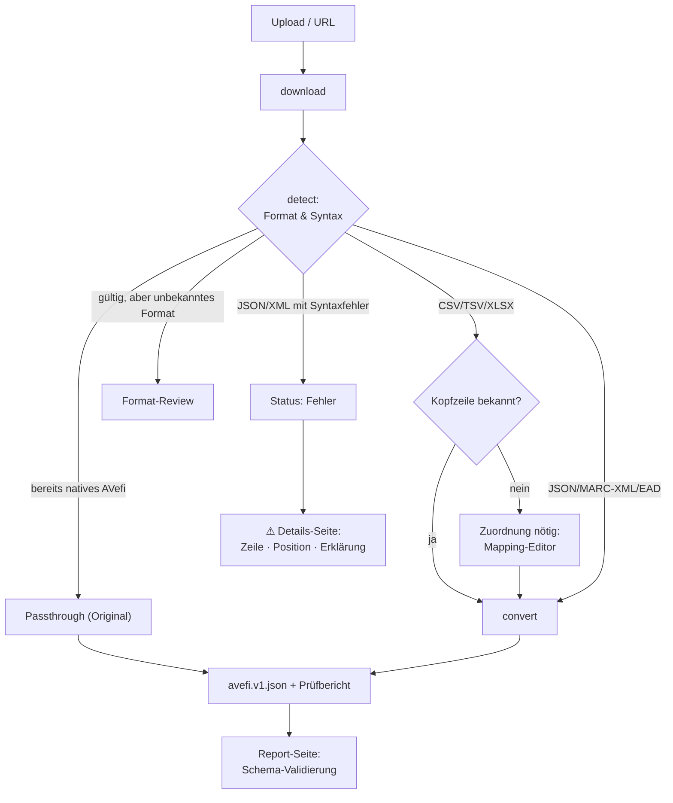

# 2 · Metadaten importieren

## Datei hochladen

Auf der Startseite (Import-Übersicht):

- **Drag & Drop** oder **„Dateien auswählen"** — mehrere Dateien gleichzeitig, max. 200 MB.
- Der Fortschritt wird pro Datei angezeigt; danach erscheint der Import in der Liste.

Unterstützte Formate: **CSV · TSV · XLSX · JSON · MARC-XML · EAD ·
(weitere XML → Formatprüfung)**. Vertraglich geschuldet sind CSV und XLSX, der
Rest ist Zugabe.

**`.xls` und `.ods` werden nicht gelesen.** Die Datei in Excel oder LibreOffice
unter *Speichern unter → Excel-Arbeitsmappe (.xlsx)* ablegen und diese hochladen;
der Importer weist die alten Formate mit genau diesem Hinweis ab.

Beispieldateien zum Ausprobieren liegen im Repository unter
[`samples/`](../samples/) (`films.csv`, `films.tsv`, `films.xlsx`, `films.json`,
`films.marcxml`, `films.ead`, `avefi-native.json`).

## Liste einschränken

Über der Liste stehen eine Suche, ein Schalter **„Nur mit Beanstandungen"** und die Wahl
des Verarbeitungsstands. Sortiert wird über die Spaltenköpfe — Datei, Verarbeitung,
Datensätze und Anlage. Ein zweiter Klick dreht die Richtung um.

Beides wirkt auf den **ganzen Bestand**, nicht auf das gerade Sichtbare. Rechts steht,
wie viele Importe die Auswahl trifft.

Die Einstellung steht in der Adresse. Eine gefilterte Liste lässt sich damit
weitergeben — `?issues=1&sort=records&dir=desc` zeigt bei allen dasselbe.

Dieselben Möglichkeiten gibt es bei den Zuordnungsprofilen, dort mit Suche über Profil-
und Einrichtungsnamen.

## Anzeigename

Ein Import trägt den Dateinamen, mit dem er hochgeladen wurde. Läuft dieselbe Datei
mehrmals, stehen in der Liste gleichnamige Zeilen nebeneinander, unterscheidbar nur am
Zeitstempel.

Auf der Detailseite lässt sich unter **Anzeigename** ein eigener Name vergeben — aus der
Liste führt der Weg über **„…" › „Umbenennen"**. Der Name steht danach in der Liste und
in der Überschrift, der Dateiname darunter.

Der Dateiname wird dabei **nicht** ersetzt. Er ist die Verbindung zur Lieferung des
Archivs; wer später fragt, aus welcher Datei ein Datensatz stammt, braucht ihn. Ein
leeres Feld entfernt den Anzeigenamen wieder.

## Import via URL

Neben dem Datei-Upload gibt es das Feld **„oder per URL"**: eine öffentlich
erreichbare `https://…`-Adresse eintragen und „Von URL laden". Ein Worker lädt die
Datei im Hintergrund herunter und stellt sie wie einen normalen Upload in die Pipeline.

> Interne/private Adressen (localhost, private IP-Bereiche) werden aus
> Sicherheitsgründen abgelehnt.

## Verarbeitung (Worker)

Nach dem Upload liegt der Import auf **„Wartend"**. Die Verarbeitung übernimmt der
**`worker`-Dienst** automatisch: ein Daemon, der jede Minute die `worker_jobs`-Queue
pollt und die Schritte `download` → `detect` → `convert` abarbeitet.

Zum manuellen Anstoßen (Debug):

```bash
# Der Worker laeuft als eigener Container und arbeitet die Warteschlange von
# selbst ab. Nachsehen, was er tut:
docker logs avefi_worker --tail 40

# Nach einer Codeaenderung am Worker: neu starten (er beendet sich sonst erst
# nach WORKER_MAX_UPTIME von selbst).
docker restart avefi_worker
```

Ablauf je Import:

| Status | Bedeutung |
|--------|-----------|
| Wartend | in der Warteschlange |
| In Konvertierung | Format erkannt, Converter zugeordnet |
| Neues Format – Review nötig | unbekanntes Format → [Format-Review](04-format-review.md) |
| Konvertiert | Datensätze erzeugt, editierbar |
| Fehler | Parsing/Validierung fehlgeschlagen |

Der `worker`-Dienst läuft kontinuierlich (`restart: always`) und startet sich nach
7 Tagen bzw. bei RAM > 1 GB selbst neu.

## Ablauf (Pipeline)



## Herkunft eines Ergebnisses

Auf der Detailseite eines Imports steht unter **Herkunft des Ergebnisses**, womit
diese Datei konvertiert wurde. Gemeint ist der Stand des Laufs, nicht der von
heute — genau das ist der Unterschied, um den es geht, wenn ein Ergebnis nicht
mehr zu erklären ist.

Der Abschnitt nennt:

* **Formatprofil** — bei Formaten mit festem Konverter, etwa MARC-XML oder
  AVefi-nativ. Daneben steht der interne Schlüssel, damit man im Zweifel weiß,
  welcher Konverter gemeint ist.
* **Zuordnungsprofil** samt der Version, mit der gearbeitet wurde. Steht das
  Profil heute auf einer anderen Version, sagt die Zeile beide Zahlen und weist
  darauf hin, dass sich seither etwas geändert hat. Der Name führt zum Profil.
* **AVefi-Schema**, gegen das geprüft wurde.
* **Trennzeichen**, bei CSV. Ein Tabulator steht als `Tab` da, sonst wäre die
  Angabe von „leer" nicht zu unterscheiden.
* **Normdaten** — ob die Anreicherung bei diesem Lauf eingeschaltet war und mit
  welcher Obergrenze. Ein Ergebnis mit und eines ohne Anreicherung sehen
  verschieden aus, ohne dass sich Datei oder Profil geändert haben.
* **Konvertiert am**.

Bei Importen, die vor Einführung dieser Aufzeichnung liefen, steht in den Zeilen
„nicht aufgezeichnet". Der Abschnitt bleibt trotzdem stehen: Dass nichts
mitgeschrieben wurde, ist eine Auskunft. Ein erneutes Konvertieren trägt die
Angaben nach.

Bei tabellarischen Formaten führt der Weg zur vollständigen Spaltenzuordnung
weiter über **Zuordnung ansehen** im Menü der Importzeile. Bei allen anderen
Formaten gibt es keine Spaltenzuordnung; dort steht im Menü stattdessen
**Herkunft ansehen** und springt direkt an diesen Abschnitt.

## Format-Erkennung

Das erkannte Format/Schema erscheint als **Badge** in der Import-Übersicht — genauer
als nur „JSON" (z. B. *AVefi (nativ)*, *Objektliste (JSON)*, *MARC-in-JSON*,
*MARC-XML*, *EAD*, *JSON (fehlerhaft)*).

- **CSV, TSV und XLSX** laufen über den **Kopfzeilen-Hash**: Der Importer bildet
  eine Prüfsumme über die normalisierten, sortierten Spaltennamen und sucht das
  dazu gespeicherte Mappingprofil. Gibt es keines, pausiert der Import mit
  *Zuordnung nötig* und der Mapping-Editor öffnet sich über **Zuordnen**. Welche
  Spalte welches AVefi-Feld füllt, entscheidet also ein Mensch, nicht eine
  Heuristik — die schlägt nur vor. Siehe [Kapitel 7](07-zuordnungen.md).
- **Bei Arbeitsmappen** gilt als Datenblatt, was mindestens zwei Spalten und eine
  Datenzeile hat; Deckblätter fallen heraus. Bleibt genau ein Blatt übrig, wird es
  ohne Rückfrage genommen, bei mehreren erscheint die Blattauswahl. Jedes gewählte
  Blatt wird ein eigener Import.
- **Bereits natives AVefi-JSON** wird erkannt und **unverändert durchgereicht**
  (kein erneutes Mapping).
- **MARC-XML** und **EAD** werden am Wurzelelement und Namensraum erkannt und mit
  einem eigenen Konverter verarbeitet. Sie brauchen kein Mappingprofil, weil ihre
  Struktur die Bedeutung mitbringt. Die Sprachangabe wird dabei nicht übernommen —
  dafür gibt es keine gesicherte Abbildung auf das AVefi-Vokabular, und geraten
  wird nicht. Der Prüfbericht weist es als Hinweis aus.
- **Syntaktisch kaputtes JSON/XML** → Status **Fehler** mit
  [Fehlerdetails](03-bearbeiten-und-validieren.md#fehlerdetails-verarbeitungsfehler)
  (Zeile/Position, Code-Ausschnitt, Lösungshinweis).
- Alles andere (gültiges, aber unbekanntes XML/JSON, CSV ohne Titel-Spalte) landet im
  **Format-Review**.

## Excel-Arbeitsmappen

`.xlsx`, `.xls` und `.ods` lassen sich hochladen wie eine CSV. Eine Arbeitsmappe ist
aber keine Tabelle, sondern mehrere — deshalb fragt der Importer, welche Tabellenblätter
verarbeitet werden sollen, sobald mehr als eines Daten enthält.

Die Liste zeigt je Blatt die Zahl der Zeilen und Spalten und eine Einschätzung.
Vorausgewählt sind die Blätter, die nach einer Tabelle aussehen: mindestens zwei Spalten
und eine Datenzeile unter der Kopfzeile. Deckblätter, Legenden und Auswertungen bleiben
außen vor, lassen sich aber ankreuzen, falls die Einschätzung danebenliegt.

**Jedes gewählte Blatt wird ein eigener Import** mit eigener Kopfzeile, eigener Zuordnung
und eigenem Prüfbericht. Das ist Absicht: Zwei Blätter mit verschiedenen Spalten brauchen
verschiedene Zuordnungen. Enthält eine Mappe nur ein brauchbares Blatt, entfällt die
Frage und es geht direkt weiter.

Aus dem gewählten Blatt wird intern eine Tabelle herausgelöst; ab da unterscheidet sich
nichts mehr von einer hochgeladenen CSV. Die Originaldatei bleibt erhalten und lässt sich
über das „…"-Menü weiterhin herunterladen.

Zahlen- und Datumsformate werden so gelesen, wie sie in Excel angezeigt werden. Ein
Drehdatum kommt also als `12.03.1961` an und nicht als `22351` — Excel speichert Daten
intern als Zahl.
